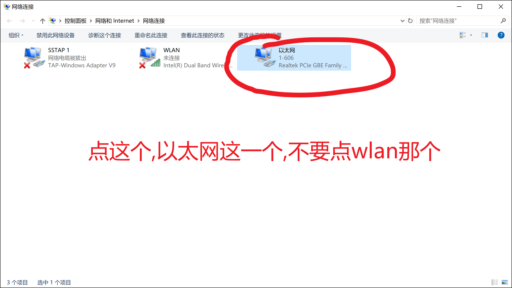
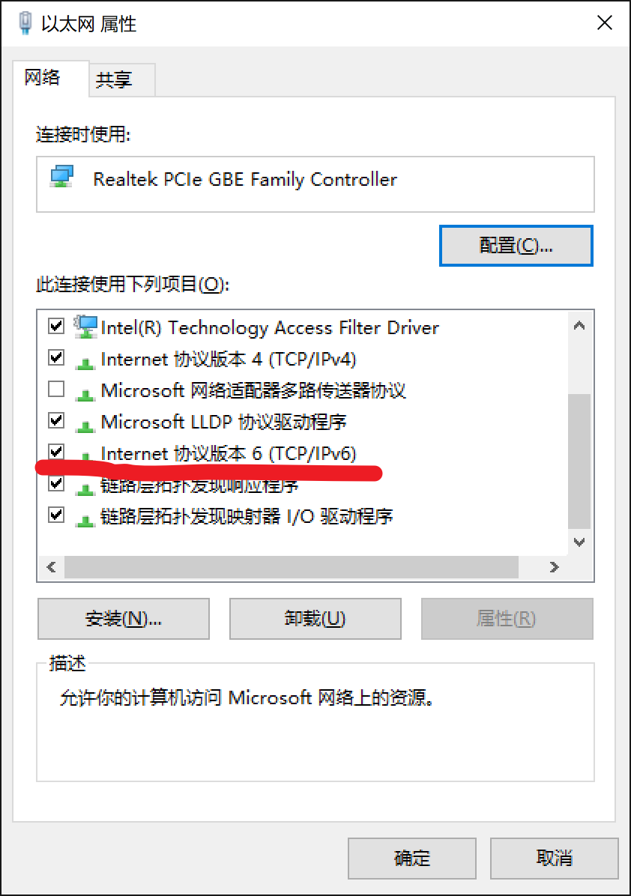

IPv6使用教程
====================

## 简介

#### 什么是IPv6？

> **网际协议第6版**（英文：**I**nternet **P**rotocol **v**ersion **6**，缩写：IPv6）是[网际协议](https://zh.wikipedia.org/wiki/%E7%BD%91%E9%99%85%E5%8D%8F%E8%AE%AE)（IP）的最新版本，用作互联网的网上层协议，用它来取代IPv4主要是为了解决[IPv4地址枯竭问题](https://zh.wikipedia.org/wiki/IPv4%E5%9C%B0%E5%9D%80%E6%9E%AF%E7%AB%AD%E9%97%AE%E9%A2%98)，不过它也在其他很多方面对IPv4有所改进。

#### 为什么要使用IPv6？

> IPv6能够帮助你开启校园网免流，访问Google，教育网PT等诸多隐藏功能哦~

## IPv6的获取渠道

* **宿舍校园网**

  校园网是指**宿舍的网口接出来的**每次上网得通过网页认证(10.0.1.190)登录的那个..

  请注意，只有以下几种连接方式才能使用IPv6：

  * 网线直连电脑，不经过路由器
  * 网线连接交换机（或者关闭了DHCP并且插的是LAN口的路由器)，交换机连接电脑
  * 网线连接路由器，路由器连接电脑。**该方法需要在路由器上进行配置，配置过程依路由器而定，有需要的同学可以自行了解**。

* **手机热点**

  注意！该渠道需视情况而定。目前部分地区的运营商已经部署了IPv6，如果手机移动数据能够获取到IPv6地址，那么电脑连接手机热点应该也是能有v6的。

## IPv6的配置

使用IPv6之前需检测你的电脑有没有开启IPv6.（以下截图均来自Win10）

>   这个,如果有√就不管,没有就勾上.,

这两步做完之后,我们就可以检测一下我们的IPv6有没有配置成功了

打开浏览器访问<http://IPv6-test.com/>

>   如果IPv6那里说的是support,那就证明你做对了.

 ## 使用IPv6访问...

我们当然不满足于只有IPv6网络,我们要用IPv6做一些事情.

比如,访问Google。

那么我们要怎么做呢?有以下两种方法。

#### 通过修改Hosts文件实现

首先访问<https://github.com/lennylxx/IPv6-hosts>,

>   点这个

>   点进去之后进入

>   点击download,下载到你的电脑上.记住这个文件的位置

然后打开我的电脑,进入C:\\Windows\\System32\\drivers\\etc,可以直接把这个复制到我的电脑中的地址栏进入,

>   里面应该是这样的

>   把你刚才下载的那个文件复制进去,会提示

选择替换目标中的文件

>   有可能提示

>   选择继续

这样hosts就替换完成了，然后你就可以访问[www.google.com](http://www.google.com)了。

如果还不能访问,你可以：

* 打开cmd，输入`ipconfig /flushdns`
* 如果你看不懂上面在说什么，那就重启一下电脑，同样能实现这个命令的效果。

