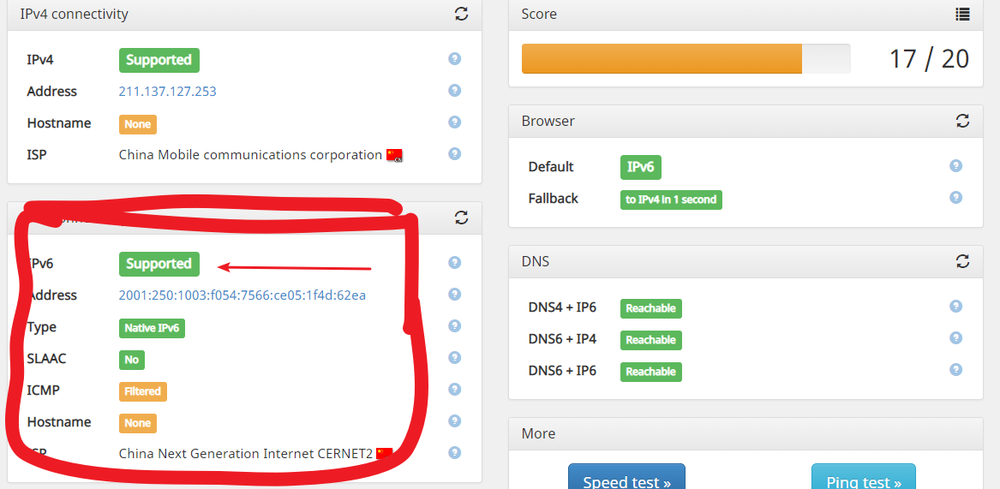
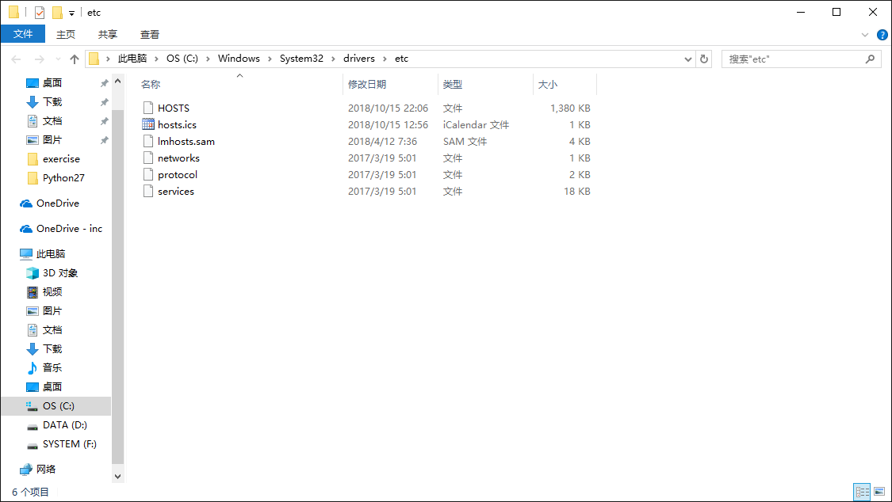
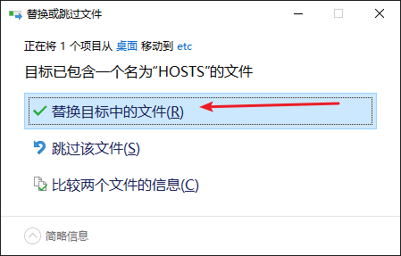

校园网ipv6的使用教程
====================

具体什么是ipv6就自己用搜索引擎查吧,不赘述.

Ipv6仅能在校园网网络下使用!翼讯不可以!手机热点不可以!

校园网是指那个每次上网得通过网页portal(10.0.1.190)登录的那个.,从宿舍的网口接出来的那一个

**第一步**
----------

应该拿网线直连电脑,是指从墙上引出来的网线直接连接电脑,不经过路由器!(但可以经过交换机,或者关闭了dhcp并且插的是lan口的路由器)

使用ipv6之前需检测你的电脑有没有开启ipv6

这个,如果有√就不管,没有就勾上.,

这两步做完之后,我们就可以检测一下我们的ipv6有没有配置成功了

打开浏览器访问<http://ipv6-test.com/>

>   如果ipv6那里说的是support,那就证明你做对了.

但我们当然不满足于只有ipv6网络,我们要用ipv6做一些事情.

比如,访问Google,访问YouTube,而且通过ipv6访问是不需要消耗校园网流量的./斜眼笑

那么我们要怎么做呢?

**第二步**
----------

首先访问<https://github.com/lennylxx/ipv6-hosts>,

点这个

点进去之后进入

点击download,下载到你的电脑上.记住这个文件的位置

然后打开我的电脑,进入C:\\Windows\\System32\\drivers\\etc,可以直接把这个复制到我的电脑中的地址栏进入,

里面应该是这样的

把你刚才下载的那个文件复制进去,会提示

选择替换目标中的文件

有可能提示

选择继续

这样hosts就替换完成了

然后你就可以访问[www.google.com](http://www.google.com)了,如果还不能访问,就重启一下电脑就ok了.

乱七八糟说了不少,也是一步一步讲的,但还是希望你们能学会使用搜索引擎,我这已经教了怎么使用Google,以后遇到问题就要先Google查一下再问,不要遇到问题第一时间想的就是问别人

Made by Moo

17-物理-张萌
